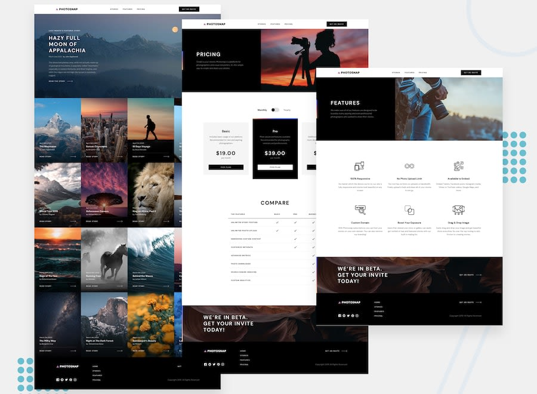
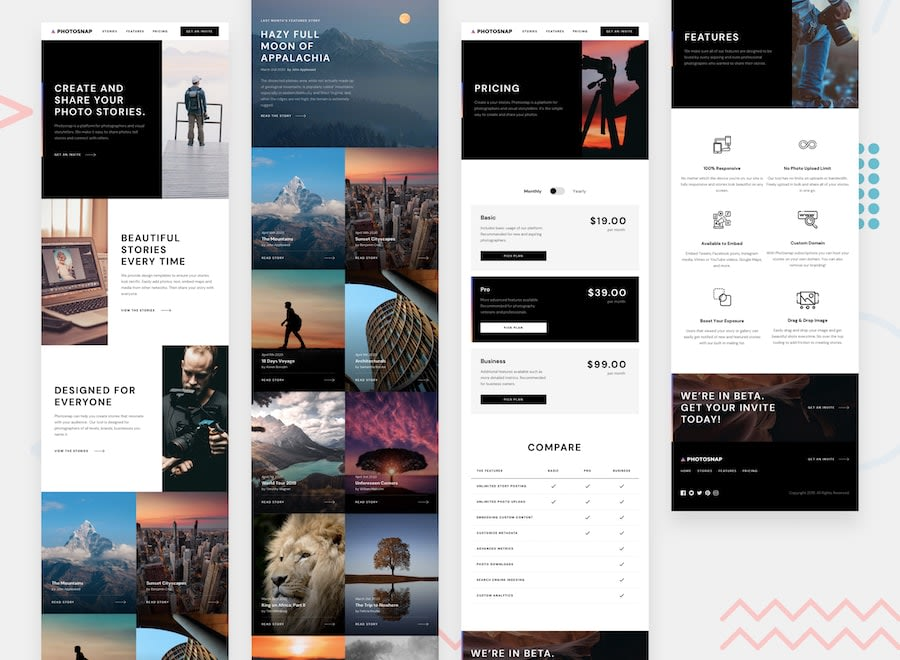
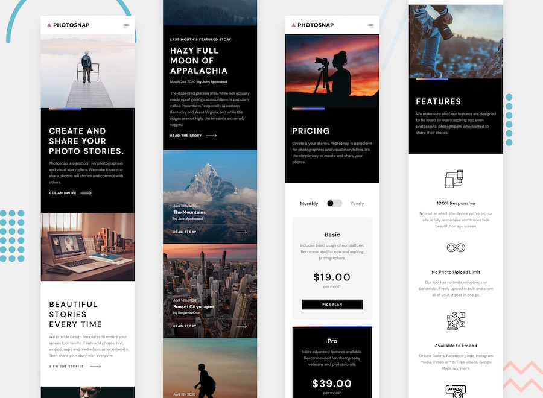

# Frontend Mentor - Photosnap-app solution

This is a solution to the [Photosanp-app challenge from Frontend Mentor, you can click here to view the chalenge](https://www.frontendmentor.io/challenges/photosnap-multipage-website-nMDSrNmNW). 

## Table of contents
- [Overview](#overview)
  - [The challenge](#the-challenge)
  - [Screenshot](#screenshot)
  - [Links](#links)
- [My process](#my-process)
  - [Built with](#built-with)
  - [What I learned](#what-i-learned)
- [Author](#author)

## Overview

### Screenshots
#### Desktop Design preview

#### Tablet Design preview

#### Mobile Design preview

### Links
- Live Site URL: [https://johakim-azix.github.io/photosnap-app/](https://johakim-azix.github.io/photosnap-app/)
- Solution URL: [https://github.com/johakim-azix/photosnap-app](https://github.com/johakim-azix/photosnap-app/)

## My process
* Start by evaluation the design wireframes, determining potential layout, components...
* Wireframe integration (mobile first workflow)

### Built with
- Semantic HTML5 markup
- CSS custom properties
- Scss
- CSS Flexbox
- CSS transitions
- CSS animations
- Mobile-first workflow
- [Vue.js](https://nextjs.org/) - Vue CLI
- Composition API & Option API
- Routing 

### What I learned
With this challenge what struck me was the error I had when building the project; indeed after the build the routing no longer worked and I had an error in console saying "c.then is not a function" every time I tried to navigate to other routes!!
It was the first time I had this bug; I did a lot of research to solve the problem when the problem was there right before my eyes!!!!

It's always frustrating when you have a bug and you debug to fix it; but when we find the solution; the more time it takes, the more it tires and the more we are angry...
And when we discover that the solution was in front of our eyes all this time... I don't know about you but I'm still fed up with phew!!!
 

## Author
I am Marlonne and you can find me on these media : 
- Frontend Mentor - [@johakim-azix](https://www.frontendmentor.io/profile/johakim-azix)
- Github  - [johakim-azix](https://github.com/johakim-azix/)
- Twitter - [@marlonneazix](https://twitter.com/marlonneazix)
- Instagram - [@marlonne_penda](https://www.instagram.com/marlonne_penda/)
- LinkedIn - [@joseph penda](https://www.linkedin.com/in/joseph-penda-051a111a7)
